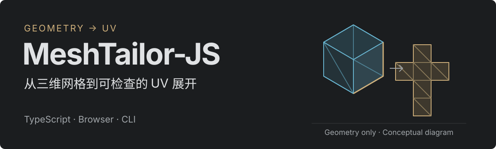

<p align="center">
  <a href="README.md"><strong>English</strong></a> &nbsp; | &nbsp; <a href="README.zh-CN.md">简体中文</a>
</p>

<p align="center">
  
</p>

# MeshTailor-JS

**Generate UVs, inspect seams, and watch 3D meshes unfold one island at a time in your browser.**

A TypeScript / JavaScript geometry tool with a full Studio, a standalone offline workbench, and an OBJ CLI. Automatic generation uses mesh geometry only; imported UVs, seams, and island assignments never guide the generator.

[Quick start](#quick-start) · [User guide](START_HERE.md) · [Documentation](docs/README.md) · [Changelog](CHANGELOG.md) · [MIT license](LICENSE)


*Studio v0.4.30, captured locally on October 8, 2026. The built-in mechanical assembly has 22,528 triangles and 16 generated UV islands; the selected gear island (#5) is highlighted in both 3D and UV views. The current interface includes Chinese labels.*

## What you can do

- **Generate and edit UVs:** cut along real mesh edges, parameterize and pack islands, then stitch, repack, or refine empty space in the generated result.
- **Inspect geometry and layouts:** examine islands, face-corner correspondence, cuts, distortion, and overlaps. Eligible rings preserve holes; tubes and repeated profiles use structural mappings.
- **Play the unfolding:** follow island relays, adjust playback speed, or scrub the timeline. 3D picking, UV selection, and export share the same result.
- **Import and export:** Studio reads OBJ / FBX / GLB / glTF and exports OBJ with new UVs. The offline workbench and CLI accept OBJ.

The shared generation path is **geometry → face partitioning and mesh-edge cuts → parameterization and quality checks → atlas packing → preview / OBJ export**. Default loading, Generate baseline, and the CLI use that same path.

## Quick start

### Try the offline workbench

Open **[unfold-lab.html](unfold-lab.html)** from your local checkout in a WebGL2-capable browser. No frontend dependencies are needed. If your browser blocks local Workers, start a local server with Node.js:

```bash
npm run lab:serve
```

Visit [http://127.0.0.1:4175](http://127.0.0.1:4175), choose a built-in model or import OBJ, then select islands, play the unfolding, and export.

### Develop locally

Use **Node.js 22.16+, npm**, and a WebGL2-capable browser. Run these commands from the repository root:

```bash
npm ci
npm run dev
```

Open the Vite URL printed in your terminal. For glTF, select the companion `.bin` files with the model. Materials and textures are not displayed. See [import formats](docs/IMPORT-FORMATS.md) for the supported scope.

### Use the CLI

```bash
npm run cli -- inspect examples/cylinder.obj
npm run cli -- unwrap examples/cylinder.obj cylinder-uv.obj
```

The `baseline` command exports seam and chain JSON. The CLI currently accepts OBJ only; see the [user guide](START_HERE.md#cli).

## Validation and contributions

```bash
npm run check:geometry   # Input isolation, cuts, topology, and generation policy
npm run check            # Unit tests, Studio build, and full type checking
npm run test:git         # Git history and tag-checker regression tests
```

When changing generation strategy, also run `npm run test:geometry:real`. Both pinned real-model fixtures are tested with original, absent, and randomized UVs; comparisons cover every actual seam and face-corner coordinate. Browser suites require Chrome / Chromium / Edge; set `CHROME_PATH` if needed. See [CONTRIBUTING](CONTRIBUTING.md).

Issues and contributions may be written in English or Chinese. Include a reproducible example and report what you tested. Preserve existing history and release tags, and keep commits focused.

## Current limitations

This is an independent geometry implementation with **no official MeshTailor learned weights**. Arbitrary surfaces can distort or fragment; the tool does not guarantee semantic pattern pieces, zero stretch, or globally optimal packing. The animation visualizes correspondence rather than cloth physics. Repainting or baking textures for the new UVs is a separate task.

Studio importers differ from the offline workbench. Offline screenshots do not certify the full Studio browser workflow. See the [maintenance and validation record](docs/OPEN_SOURCE_PREPARATION.md) and the [documentation index](docs/README.md); historical records retain their original language.

## License

Project code, original documentation, and project-created assets use the **[MIT License](LICENSE)**. Bundled Corset / Flight Helmet models and their geometry derivatives retain **CC0-1.0**. See [asset provenance](THIRD_PARTY_ASSETS.md) and the [licensing guide](docs/LICENSING.md) for scope and attribution.

English and Chinese guides are available from their language links. Switching documentation language does not change the application interface language.
