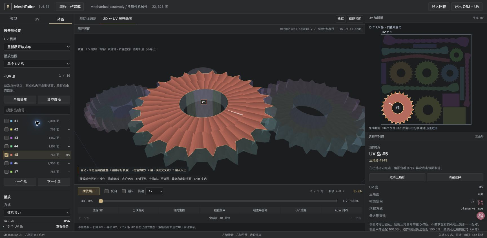

<p align="center">
  <a href="README.md">English</a> &nbsp; | &nbsp; <a href="README.zh-CN.md"><strong>简体中文</strong></a>
</p>

<p align="center">
  
</p>

# MeshTailor-JS

**在浏览器中生成 UV、检查切缝，并观察三维网格逐岛展开。**

TypeScript / JavaScript 几何工具，提供完整 Studio、免安装的离线工作台和 OBJ 命令行。自动生成只使用网格几何，导入模型的原 UV、切缝与岛划分不参与生成。

[快速开始](#快速开始) · [使用指南](START_HERE.zh-CN.md) · [文档](docs/README.zh-CN.md) · [更新记录](CHANGELOG.md) · [MIT 许可](LICENSE)



*Studio v0.4.30 本地运行实拍（2026-10-08）：内置机械组合包含 22,528 个三角面，生成 16 个 UV 岛；选中的齿轮岛（#5）在三维视图与 UV 编辑器中同步高亮。当前界面包含中文标签。*

## 能做什么

- **生成与编辑 UV**：沿真实网格边开缝，展开、面积感知排布，再对当前结果缝合、重排或填空。
- **检查几何与布局**：查看 UV 岛、面角对应、切边、形变和重叠；符合条件的环件保孔、管身与重复剖面生成结构化展开。
- **播放展开过程**：逐岛接力、倍速和进度拖动；3D 视图、UV 选择与导出共享同一份结果。
- **导入与导出**：Studio 读取 OBJ / FBX / GLB / glTF，导出带新 UV 的 OBJ；离线工作台与 CLI 使用 OBJ。

生成流程为 **几何输入 → 面分区与真实切边 → 参数化与质量检查 → Atlas 排布 → 预览 / OBJ 导出**。默认载入、Generate baseline 和 CLI 使用同一条生成路径。

## 快速开始

### 免安装体验

用支持 WebGL2 的浏览器直接打开根目录的 **[unfold-lab.html](unfold-lab.html)**。如果本地 Worker 被浏览器限制，使用 Node.js 启动：

```bash
npm run lab:serve
```

然后打开 [http://127.0.0.1:4175](http://127.0.0.1:4175)，选择内置模型或导入 OBJ，生成后即可选岛、播放和导出。

### 本地开发

需要 **Node.js 22.16+、npm** 和支持 WebGL2 的浏览器。在仓库目录执行：

```bash
npm ci
npm run dev
```

打开终端显示的 Vite 地址。glTF 导入需同时选择其 `.bin`；材质和贴图不显示。更多格式限制见 [导入指南](docs/IMPORT-FORMATS.zh-CN.md)。

### 命令行

```bash
npm run cli -- inspect examples/cylinder.obj
npm run cli -- unwrap examples/cylinder.obj cylinder-uv.obj
```

`baseline` 命令可导出切缝与链 JSON。CLI 当前仅接受 OBJ，详见 [使用指南](START_HERE.zh-CN.md#cli)。

## 验证与贡献

```bash
npm run check:geometry   # 几何输入隔离、切边、拓扑与生成策略
npm run check            # 单元测试、Studio 构建和完整类型检查
npm run test:git         # 历史与标签维护工具的回归测试
```

修改生成策略时，还需运行 `npm run test:geometry:real`：两份固定真实模型分别携带原 UV、删除 UV 和随机 UV，比较全部实际切缝与面角坐标。浏览器专项测试需要 Chrome / Chromium / Edge，可用 `CHROME_PATH` 指定程序。详细流程见 [贡献指南](CONTRIBUTING.zh-CN.md)。

欢迎提交问题、修复和可复现的回归夹具。请保留已有历史与发布标签，按独立目的提交，并说明验证范围。

## 当前边界

项目使用独立几何方法，**没有官方 MeshTailor 学习权重**。任意曲面可能出现形变或较多分片，不保证语义最优版型、零拉伸或全局最密排布。展开动画用于展示对应关系，不是布料物理模拟；新 UV 的贴图重绘与烘焙需自行完成。

Studio 的导入器与离线工作台不同；离线截图不能替代完整 Studio 的浏览器验收。本次维护的通过项与环境限制见 [开源整理记录](docs/OPEN_SOURCE_PREPARATION.md)，具体算法与历史结果见 [文档索引](docs/README.zh-CN.md)。

代码、原创文档及自制资产采用 **[MIT](LICENSE)**。仓库内的 Corset / Flight Helmet 及其几何衍生文件沿用 **CC0-1.0**；来源、作者与许可边界见 [第三方资产说明](THIRD_PARTY_ASSETS.zh-CN.md)。

双语许可范围见 [许可指南](docs/LICENSING.zh-CN.md)。文档语言切换不会改变应用界面的语言；当前界面包含中文标签。
