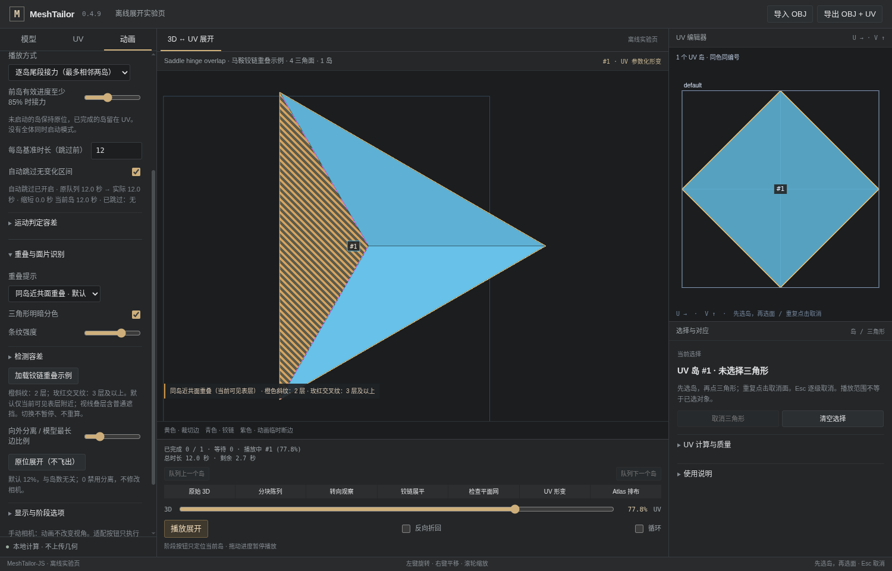

# 铰链展开中的重叠可视化 · v0.4.9

## 解决什么问题

同一个 UV 岛一直使用同一种颜色，能够保持身份对应，却使铰链展开后落在一起的三角形难以分辨。只给每个面随机染色仍不能暴露被完全遮住的同形面；普通透明也会混淆几何重叠与前后遮挡。

本版保留岛色，加入**实时的同岛近共面叠层提示**，并用轻微、稳定的三角形明暗和原有线框帮助识别单面。它读取当前动画姿态，不是把源 UV 或最终 UV 的重叠统计套到中间动画上。

**这是显示诊断，不是自动消除几何自交。** 不改变顶点、接缝、UV、铰链树、临时断边或导出结果。

## 操作

在左侧 **动画 → 重叠与面片识别** 中，默认已启用“同岛近共面重叠”。选择一个岛、拖动或播放到铰链展平阶段即可观察。范围可以是一个、多选或全部队列；诊断只处理正在显示的预览岛，保留原有逐岛接力。

| 设置 | 含义 |
|---|---|
| 同岛近共面重叠 · 默认 | 只统计同一岛内、当前可见表层附近、近乎平行且空间贴合的面片。 |
| 视线叠层 · 含遮挡 | 统计同岛在当前像素上的覆盖层数，包括普通前后遮挡；**不是几何相交**。 |
| 关闭重叠提示 | 停止诊断通道、释放其离屏缓冲区；保留普通渲染。 |
| 三角形明暗分色 | 同岛各面轻微改变亮度，按源面编号稳定分配，不随播放随机闪变。 |
| 条纹强度 | 默认 72%，可调 10%–100%。 |
| 检测容差 | 默认模型最长边的 0.01%，范围 0.0001%–1%；过大可能将靠近但未接触的平行面也标记出来。 |

橙色斜纹代表 **2 层**；玫红交叉纹代表 **3 层及以上**。条纹仅覆盖叠合的像素，非重叠部分保留岛色。使用图案加颜色而不是只用颜色区分。计数内部在255层饱和，界面只区分2与3+，不声称能够准确显示无限层数。

仍可在显示选项中打开线框。选择三角形后的高亮边框会叠在条纹之上；黄色裁切边、青色铰链和紫色动画临时断边继续显示。原有“先选岛，再选面，再次点击取消”不变；提示层不拦截鼠标。

切换上述设置不会暂停播放、重置进度或相机，也不会重新求解 UV。反向播放、逐岛接力和跳过静止区间使用原来的时间线。

## 实际示例，不是设计稿

点击 **加载铰链重叠示例** 会替换当前模型，载入四个三角形组成的马鞍曲面：1个真实连通 UV 岛。初始三维状态不叠合，沿真实铰链展平时平面网出现重叠；随后变到有效的菱形目标 UV，重叠提示消失。

示例保留真实铰链和源到目标对应过程，没有为了截图偷偷把目标 UV 叠起来。可以在铰链末段暂停、转动相机、切换提示模式，并检查右侧源/目标UV。



截图来自本工程的离线工作台，明确标为离线展开实验页；不是完整 React Studio 实测截图，也不是服装人台或飞行头盔。

## 渲染实现

共用生产模块 `apps/studio/src/unfold/overlap-pass.ts` 使用 WebGL2 的三个 GPU 通道：

1. **可见表层**：绘制最近表面的岛编号、法向、24位线性视深。实体的未选上下文参与遮挡但不参与叠层；隐藏/半透明上下文不阻挡活动岛的诊断。
2. **覆盖层数**：再次绘制活动岛，匹配最近表面的岛编号。默认还检查法向差（绝对法向夹角不超过2°）和双向平面距离。通过后在RGBA8目标里加1层，不执行逐三角形两两遍历。正反绕序都只计一次，邻面正常共享边不因双面绘制而重复计数。
3. **条纹合成**：仅将计数至少2的像素覆盖条纹；普通底色、检查面边界和铰链标记继续使用原通道。

距离阈值取 `max(源模型最长边 × 相对容差, 2 × far / (2^24−1))`。第二项只补偿线性深度编码的量化误差；不是直接拿非线性深度缓冲差当世界距离。两边法向都检查，正反面翻向不会漏掉完全叠合。

法向导数在任何逐像素拒绝分支之前求值，避免不同GPU驱动在非一致分支中的导数行为差异。计数关闭dither，不依赖浮点混合扩展。普通动画不读取GPU像素；显式的 `getOverlapCounts()` 仅供测试诊断，不接入正常播放循环。

离屏最长边上限2048、像素数上限2,097,152，并遵守设备纹理/渲染缓冲上限。四张RGBA8纹理加深度缓冲，理论目标存储约40MiB以内，实际驱动开销另计。诊断增加两次网格绘制与一次全屏合成；并不承诺大模型免费运行或固定帧率。关闭诊断可释放这些目标缓冲。

着色器或诊断通道的可捕获失败会显示“重叠提示不可用”，继续普通网格显示；关闭后重开可显式重试。不声称在真实显存耗尽、驱动重置等所有故障下仍能继续。上下文恢复会重新创建诊断资源，已测试真实 `WEBGL_lose_context` 恢复后的绘制和相机状态。

WebGL2官方接口与格式依据：
https://registry.khronos.org/webgl/specs/latest/2.0/

## 不能混淆的边界

本版是**当前可见表层附近的屏幕采样诊断**。它不是完整3D碰撞求解器，不输出全局相交面积，也不证明最终UV无自交。

- 非平行三角形彼此穿过，不一定被默认模式标出；视线模式能够提供遮挡提示，但仍不能把投影层数当空间交线。
- 深处的重叠可能被同岛另一层或别的实体岛遮住。可以转动相机、单选相关岛，并隐藏未选上下文；不使用无条件穿透把所有背景都染红。
- 不同岛的相互交叠不纳入本次“同岛”诊断。多个岛叠在同一像素时，以最近可见岛为分类，不把多个岛累加成同岛错误。
- 屏幕亚像素、近乎侧看的退化投影、阈值附近的轻微分离会受到采样精度和容差影响。画面极大时诊断按上限缩小，因此边界可能有1–数个显示像素的差异。
- 颜色明暗本身只是识别辅助手段，不能作为无重叠证明。
- 铰链中间平面网重叠，不代表最终UV一定重叠；反之，提示消失也不能代替现有UV有效性检测。

需要真正无碰撞的展开路线，应另行设计碰撞约束或新铰链/切割路径。本版没有用平移、缩放面片或隐藏几何来伪造无重叠结果。

## 回归入口

```bash
npm run test:overlap
npm run lab:build
npm run test:overlap:browser
npm run test:overlap:workbench
```

前者是纯策略；后两者使用真实 Chromium、生产WebGL和（工作台套件中的）生产UV Worker。Linux无硬件GPU环境可显式设置 `CHROME_SOFTWARE_WEBGL=1`，普通本机不必开启。完整React依赖验证仍按原 `npm run build`、`npm run test:browser`，不能用离线测试替代。
