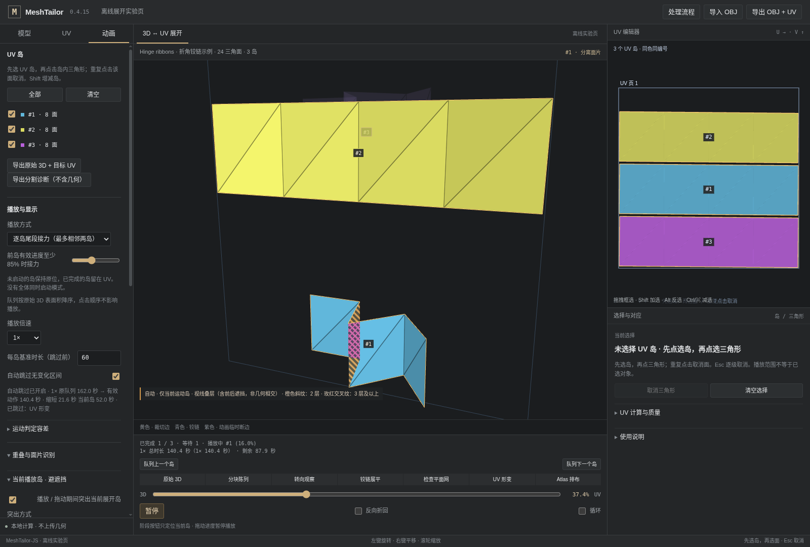

# v0.4.15 · UV 落位亮显与平滑渐隐

本版修复：UV 岛刚完全到达 3D 场景中的目标 UV 位置，就立即被划入半透明背景，难以看清落位结果。基于现有 v0.4.14 继续小步提交，不移动任何旧 tag。

## 默认显示过程

| 状态 | 显示 |
|---|---|
| 岛仍在运动，包括最后移入 UV 的过程 | 保持实体与岛色 |
| 完全到达目标 UV 后的 0.8 秒 | 在精确的最终 UV 位置保持原色亮显，保留轮廓、编号 |
| 随后的 1 秒 | 表面颜色、不透明度、轮廓及编号连续渐隐 |
| 该岛展示结束，但队列仍在播放 | 融入背景不透明度（默认18%） |
| 暂停、松开进度条、取消手势或整段播放结束 | 立即撤销临时显示，恢复原来的选择／上下文设置 |

渐隐不是在某一帧突然换材质：归一化渐隐进度为 t 时，亮显权重为 `1 - t²(3 - 2t)`，不透明度为 `background + (1 - background) × weight`。原色到背景灰调、黄色裁切轮廓和编号共用该权重，避免透明度刚变化就先突然失去岛色。

“亮显”是保留完整的岛色和轮廓，不是白色闪光或额外光照。非活动的等待岛仍半透明；正在展开的后继岛继续保持实体。

## 不挤占运动时间

这是独立的**显示尾段**，不是往每个岛的几何时间线上插入1.8秒静止。原队列、85%接力、倍速、面积顺序和静止区间跳过均不变。下一岛无需等待亮显或渐隐结束。

显示时长按真实可见秒数计时，切换16×或64×不会把0.8秒亮显压缩到看不见。高倍速可以有多个已落位岛同时处于显示尾段；它们已完全不动，不被计入“最多两岛同时运动”的限制。后继运动岛仍优先实体绘制。

每岛记录一次**向前越过完整终点**的事件；停在完成姿态反复渲染不会重启计时。初次从中途播放不重新点亮早已完成的岛；反向播放、回拖、循环回到起点、换选择／几何和暂停都会清理旧事件。零运动时长的岛不凭空新增展示等待。

到达队列最终终点时依然立即结束播放、恢复原显示；不为最后一个岛额外延迟整个播放结束。此时最后一个岛仍保留正常显示，而不是继续强制淡化。

## 设置入口

**动画 → 当前播放岛 · 避遮挡**：

- **到达 UV 后亮显（秒）**：默认0.8，范围0–5。
- **随后渐隐（秒）**：默认1，范围0–5。

这两个选项只对默认的“其他岛整体半透明”方式生效；旧球形散点方式不参与本次显示尾段。设为0＋0可对照原先的即时半透明行为。

修改选项不重算 UV、不更换快照、不修改相机或几何播放位置。按住进度条跨过某岛终点后，即使停止移动鼠标，显示尾段仍会继续；松手、Esc／取消手势、失焦等原有恢复行为保持不变。隐藏的浏览器页不消耗显示时间。

右侧二维 UV 编辑器不改变透明度，处理的是3D场景中已落位和正在展开的岛。所有模型顶点、切缝、岛归属、UV坐标、导出结果和UV处理流程未改动。

## 实现与回归

`arrival-presentation.ts` 负责独立状态和连续权重；`webgl-view.ts` 将落位岛与背景分开绘制，淡出帧只调整渲染，不写位置缓冲、不推动几何进度、不自动适配相机。标签及边界同步渐隐。严格逐岛的精确接缝时刻也不再短暂把所有等待岛恢复实体。

```bash
npm run test:arrival
npm run lab:build
npm run test:arrival:browser
npm run test:arrival:workbench
```

本轮通过26项策略、30项真实WebGL像素（两种DPI）和10项实际播放／拖动交互测试。截图使用内置三块折角带，来自实际离线工作台：黄色岛已在UV上亮显、蓝色后继岛仍在运动。



没有重新执行原始人台／头盔的全部UV求解，未把旧版正确模型回归算作本版新测试。算法包及正确模型夹具的内容与v0.4.14保持一致（包版本元数据除外）。

完整 React/Vite 构建仍因缺失依赖未通过。两套UI已接线；浏览器测试用离线工作台与共用生产模块，不等同于主 React 页面端到端认证。具体结果见 `VALIDATION.md`。
