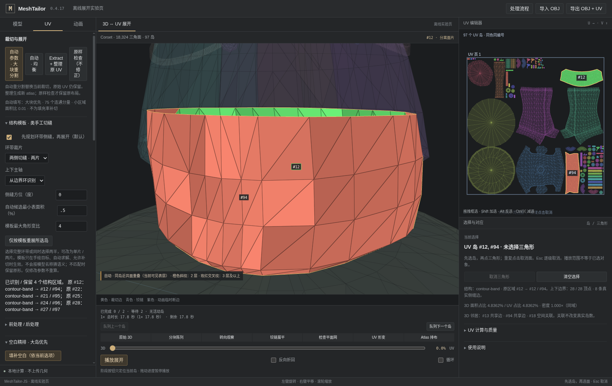
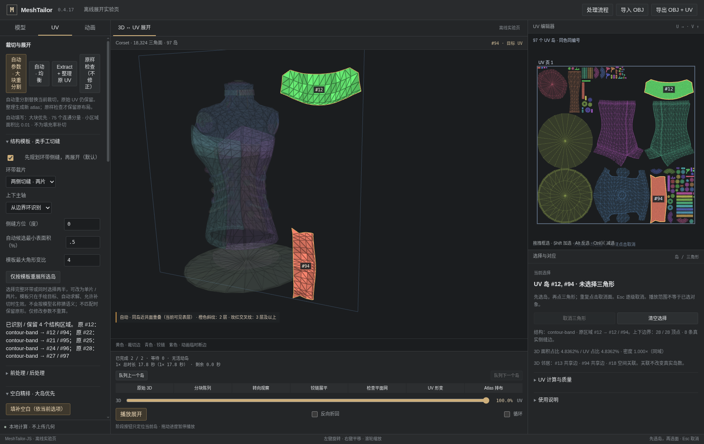

# v0.4.17 · 先选择结构与切法，再展平

## 人台底圈的实际结果

针对用户截图所指 **Corset 原 UV #12、224 个三角面**，默认不再沿原来的任意开缝直接保留/重算一张陌生的岛，而是先识别上下两个边界环，找到侧向，沿真正网格边切开，再求解。默认 **两侧切缝 / 两片**；可改为 **单纵缝 / 一整条**。两条切缝分别连接上下边界，没有三角面丢失或凭空焊接。

两片模式在该真实区域使用 `human-contour-band`，最大单三角形各向异性约 **1.195**；不是圆边界解，不是把三角形逐块重新拼成另一种拓扑。得到两块弧形边界的连续裁片。单缝结果也随包提供。这并不承诺精确复制手绘红线像素：截图并非三维接缝标注，切缝由原网格、轴向及可调方位决定。





## 默认加载与明确的局部操作

在 **UV → 手绘轮廓优先 → 结构模板 · 人工切缝思路** 中，模板默认开启。完整源 UV 的整理流程为：

```
提取原 UV / 审计 → 仅修复无效源岛 → 识别结构、规划侧缝、验证模板
    → 保护模板边界后的普通邻岛缝合 → 面积归一及排布
    → [按载入配置可选的轮廓填空] → 同一份动画对应与统计
```

流程面板单独记录结构步骤的开始、完成和跳过。生成路径在参数化阶段识别完整的环带，避免先按局部法线将它拆碎；平面面板仍保留齿形、凹口和孔洞。模板要求手绘目标、自动求解、允许补切；强制 LSCM/Tutte、旧紧凑目标或关闭模板时不偷偷覆盖选择。

**仅按模板重展所选岛** 使用显式检查选择，不把“全部播放”当成全部已选中。选一个完整底圈可以将它拆成两片；选择已经拆开的两片，可以重新规划为一条。只合并所选且真实共享边的区域进行这次识别，不跨断开的物体建立假邻接。选择不完整、主轴不合适或检查失败时会显示具体未应用原因，保留那些岛的形状。

修改参数不会立刻重算或移动相机，需点击局部按钮或明确应用 / 重跑。**原样检查** 不应用模板；**只重排** 不改变形状；后续缝合保留模板边界。进一步精排仍只移动、旋转、等比例缩放，保留元数据。已经存在结构模板时，明确拒绝同时执行旧的大岛“恢复旧切缝”实验，防止刚建立的可读裁片又被自动切坏；需要改切法时用显式局部模板操作。

## 可配置项

| 参数 | 默认 | 含义 |
|---|---|---|
| 环带裁片 | 2 片 | 1 = 单缝整条；2 = 对侧两缝。不是要求所有曲面都切为两片。 |
| 主轴 | 自动 | 从上下边界环平面确定，也可手动选 X/Y/Z。不是相机朝向。 |
| 方位 | 0° | 绕主轴旋转侧缝方向，范围 −180°..180°；仍落在真实网格边。 |
| 自动候选最小表面积 | 0.5% | 避免细小饰物都被拆为两片；显式选区可越过此面积门槛，但仍受质量约束。 |
| 模板最大角形变比 | 4 | 所有三角面的最大奇异值比，不用平均值掩盖极小面；范围1.1..20。 |

原有全局单岛面数、长宽比、留白、形变与任务取消/时间预算继续生效。切缝设计与装箱是两步：装箱允许整片旋转，但不重新扭曲或镜像模板形状。需要相同上下方向用于绘制时，关闭“允许旋转排布”；本版没有强制旋转所有其他岛来对齐某一块。

## 实现原理与质量门槛

`human-templates.ts` 在原始面集合上检查 Euler 数、两个边界环、边界法向一致性、绕轴有序性、轴向分离、环平面误差及径向拟合。完全按几何工作，没有 Corset/FlightHelmet 名称或 #12 编号的分支。

- 近理想圆柱：基于圆周角 / 轴向长度构造条带。
- 近理想截锥：按斜长与展开扇角构造扇区，而不是强行画成长方形。
- 椭圆或非均匀环带：先固定有意义的侧缝，再使用自由边界 LSCM，沿环向 / 上下向对齐。这个模板不接受 Tutte 圆周最终回退。
- 平面 / 带孔平面：沿用可验证的平面轮廓展开。其他曲面保留既有手绘保形路径，报告不匹配原因，而不是伪造一个模板结果。

每个候选检查盘状切割拓扑、全部三角面的翻面、退化、正面积交叠、最大各向异性等；失败回退不污染原结果。规划的切缝和区域接口在后续缝合中受保护。通过源面身份重新映射最终岛编号，避免合并重编号后检查器关联错误。再次重排/填空保留模板身份，不会修改上一份快照中的元数据。

**这不是语义识别、服装纸样算法或全局最优裁切器。** 非可展曲面仍有形变；无法在不增加切缝或拉伸的条件下把任意表面无失真“拍平”。几何指标也不等于人工可识别性评分。对头盔壳体等非环带结构，当前不会声称已实现新的对称壳体语义模板。

## 正确真实模型回归

只使用已校验的 `examples/verified-models`；没有使用早期错误 ZIP。

| 输入 | 源面数（全部保留） | v0.4.16 手绘普通整理 | 本版默认 | 本版普通排布占用率 |
|---|---:|---:|---:|---:|
| Corset | 18,324 | 92 岛 | 97 岛；4 个结构区域被识别 | 60.5659% |
| FlightHelmet | 94,722 | 173 岛 | 179 岛；4 个结构区域被识别 | 40.6834% |
| 内置 Low 齿轮 | 1,536 | 5 岛 | 6 岛；正反齿形面保留，侧环带按两片展开 | 27.7518% |

本版不是减少岛数的优化，不能将更多裁片的结果宣传成更少。普通排布没有运行额外多轮填空，不能拿其占用率与旧版90秒精排比较。实际输出 OBJ 经独立 Shapely/GEOS 全三角形求交检查，两份完整模型正面积交叠均为0，3D位置和面顺序不变。真实模型相同平均纹素密度继续维持。

源模型和旧 UV 不变；新 UV 通常需要重新绘制/烘焙贴图。本版没有贴图烘焙功能。

## 同一动画时间轴继续保留

落位后保持0.8、渐隐1，依旧是 **1×动画秒**。倍速、暂停/恢复显示、倒放、拖动及停止拖动的行为保持 v0.4.16 的修正。不增加独立墙钟，也不阻塞下一岛接力。

动画沿模板后的真实接缝使用同一份最终 UV；仍是三角面铰链教学预览，不是物理纸张/布料。紫色临时断边、刚性网后向目标 UV 的必要形变仍明确区分，不能将该动画称为全局无自交折纸。

## 文件与运行

- `unfold-lab.html`：无需 npm 安装的离线工作台（支持 OBJ / 内置样例，不是通用 FBX/GLB 导入替代）。
- `examples/human-uv/Corset-bottom-1.obj`、`...-2.obj`：本次真实底圈的一片 / 两片结果；附源面/顶点索引映射。
- `examples/human-uv/Gear-structured.obj`：本次六岛齿轮。
- `validation/v0.4.17/real/*-organized.obj`：完整人台 / 头盔结果；同目录原始 UV 对照和参数/哈希报告。
- 查看交付 OBJ 使用“原样检查”，不要为查看而重复整理改变编号。

```
npm install
npm run dev
npm run test:human-uv
npm run test:human-uv:integration
npm run lab:build
npm run test:human-uv:browser
node scripts/verified-models-smoke.mjs --models examples/verified-models --out validation/local-human --export --snapshots --config '{"timeBudgetMs":240000}'
```

正确模型、生产拓扑/UV Worker、离线WebGL和导出检查已实际验证；完整 React/Vite 构建与通用Three加载入口未通过本环境认证，具体命令退出码见 VALIDATION.md。所有旧 Git tag 保持不动，本版使用独立附注 v0.4.17。

### 参考与未复刻的部分

方案参考结构投影、边界先行控制与自由边界参数化的职责划分，独立 TS 实现；不宣称实现了完整 BFF 或某 DCC 的同等算法。
- Blender UV tools: https://docs.blender.org/manual/en/latest/modeling/meshes/editing/uv.html
- CGAL Surface Mesh Parameterization: https://doc.cgal.org/latest/Surface_mesh_parameterization/index.html
- Sawhney & Crane, Boundary First Flattening: https://arxiv.org/abs/1704.06873
