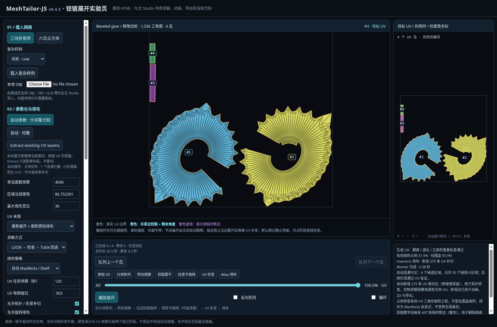

# v0.4.5 — 自动大块分区与末段翻面修复

本版沿 v0.4.4 的 Git 历史继续开发；源码为 TypeScript/JavaScript。不是官方 MeshTailor checkpoint，不是 xatlas/CGAL 二进制集成。

## 一、推荐的操作

在主 Studio 载入模型后，打开「UV 求解与排布」，点击 **自动参数 · 大块重分割**。程序读取当前网格的连通分量、面数、表面积与折角分布，填入参数，然后生成接缝和 UV。不需要先去猜曲率百分位或手工试很多数字。

自动按钮会替换当前的接缝方案；源网格及源 UV 保留，但新 UV 不保证保持旧贴图外观，贴图流程可能需要重新烘焙。它不是悄悄删除作者接缝的“原 UV 提取”。

| 操作 | v0.4.5 行为 |
|---|---|
| 默认加载 | 使用按当前几何建议的大块参数，生成完整目标 UV。 |
| Generate baseline | 默认连通区域策略；使用当前已应用的参数；旧阈值 baseline 仅在 legacy 策略使用。 |
| 自动参数 · 大块重分割 | 重新分析、填写参数、清除当前接缝约束并生成大块方案；保留留白和任务预算设置。 |
| 自动参数 · 均衡 | 同样自动填写，但区域角度、形变阈值更严格，通常允许更多岛。 |
| Extract existing UV seams | 读取原接缝、原 UV 岛和逐面角坐标，不重切、不重排、不修复作者 UV。 |
| 应用并重新展开 | 应用编辑后的参数，但保留当前输入接缝；不会偷偷合并已有切开的岛。 |

要把已有碎岛改成大块，请使用自动重分割按钮，而不是反复 Extract。原 UV 本身确实很碎时，Extract 仍会如实显示这些碎岛。默认遍历只更新接缝高亮；不再用每一步尚未完成的接缝重新计算另一套 UV。逐步接缝重切仍是显式诊断选项，不是默认。

离线页 `unfold-lab.html` 同样有大块/均衡/Extract 按钮，支持内置样例和 OBJ。FBX/GLB 的入口仍在完整 Studio。

## 二、碎片化的原因与修复

旧 baseline 按非零折角分位数大量选边，齿面/褶皱的小变化也容易变成接缝。旧求解器默认每岛 2048 面、长宽比 6、填充比至少 0.4、形变比 12；非盘状区域再经增量 disk-growing，很容易产生小尾片。即使上游接缝较少，也可能在 UV 阶段被切碎。

本版改用连通区域生长，区域法线锥角而非单边折角作为候选范围；按真实相邻边界和表面积把小区域合入邻区。合并不穿过用户固定接缝，不跨独立源部件焊接，不减面。重要的低面数面板不会仅因三角形少而当噪声吞掉。面积比较采用尺度相对的确定性排序，避免归一化前后产生不同分区。

环状/多边界区域先尝试短路径连接边界；封闭零亏格区域尝试切开一条路径，使其成为盘状 UV 域。增加切缝不必等于增加很多 face-connected 岛。多孔/高亏格、退化、非流形或求解失败时仍可能需要进一步分区，不能承诺任意模型只分成几个大块。

| 参数 | 自动大块策略 |
|---|---|
| 区域法线锥角 | 基于折角统计，约 80–90°，用户可改。 |
| 小区域面积比 | 默认相对连通分量面积 0.01；还有面数筛选与重要面板保护。 |
| 单岛面数 | 依据面数规模推荐，4096–20000；它是求解预算，不是目标岛面积。 |
| 长宽比上限 | 24；细长但有效的条带不会像旧阈值那样容易被切碎。 |
| 最低包围盒填充比 | 0，即不单纯为填充率补切。 |
| 角形变阈值 | 最大奇异值比 30；均衡模式 16；不是“30%拉伸”。 |

所有实际参数可修改。增加大块倾向可能增加拉伸、降低装箱利用率、延长求解时间；仍执行翻面、退化、交叠和数值有效性检查。它不是按照头盔/齿轮语义分类的神经网络，也不保证精确目标岛数、最优纹素分布或全局最优装箱。界面报告输入独立连通部件数，帮助判断“很多碎块”是否已经存在于源拓扑中。

## 三、实际分区对比

同一份内置 Low 几何，旧 v0.4.4 与新默认/自动策略的最终生成 UV 岛数：

| 模型 | 三角面 | 旧默认加载 | 旧 Generate baseline | 新默认加载 / 自动大块 |
|---|---:|---:|---:|---:|
| 齿轮 | 1536 | 61 | 254 | 4 |
| 褶皱服装 | 3072 | 21 | 219 | 10 |
| 三叶结 | 2304 | 85 | 261 | 7 |
| 多部件机械件 | 5632 | 272 | 388 | 31 |

这不是只算区域生长的候选数：统计经过 UV 求解、检查及必要补切后的岛数，覆盖全部源面。新 Low 和 Medium 四类样例都没有少于 16 面的岛，但这只是这些测试样例的结果，不是对所有输入的保证。Medium 齿轮 3 岛、服装 14 岛、三叶结 32 岛、机械件 49 岛。

原 UV 读取的 Low/Medium 岛数为 1、1、1、4；它们不再因错误走生成路径而显示成几十/几百岛。原 UV 保留模式不承诺其重叠/镜像/拓扑质量符合生成检查。

90,112 面程序机械件通过真实生产 Worker：生成 117 岛，完整覆盖全部面，约 37.23 秒含传输；原 UV 4 岛约 4.42 秒。测试期间还有浏览器回归运行，这不是性能基准，也不代表 FlightHelmet 的速度。

## 四、动画方向修复

以前刚性平面网只做二维旋转去匹配目标 UV，无法匹配镜像 UV 的反向绕序；直线插值会把面压到零面积后翻到另一边。现在先检查目标 UV 的面积方向，在前面的刚性转向阶段用行列式为 +1 的三维旋转完成正反面匹配。原始 UV 坐标不被改写。

另一个独立问题是：起点、终点都不翻面，不代表中途直线插值不翻面。代码解析检查整个线性路径中三角形 Jacobian 的最小行列式。有风险且两端有效同向时，对该岛采用旋转与正定伸缩插值 `R(tθ)((1−t)I+tS)`，避免中间穿过零面积。

这项回退按三角形进行，可能在非刚性的 UV-fit 阶段打开额外临时裂缝，用紫色线标明；它不是保持所有共享边连接的连续网格变形，不保证无穿插或物理合理。最终端点精确等于同一份目标 UV，不修改真实接缝导出。不能把内部已有混合翻面的无效源 UV 靠整岛转向修好，此时保留原 UV 并明确警告，需重新生成 UV 才能修复。

最终排布阶段只有平移和正比例缩放；正常的面内排布旋转不等于翻面，可通过「允许旋转排布」控制生成方案。自由相机、接力、反向和跳过静止区间保留。

## 五、工程与复现入口

新增 `test:regions`、`test:slits`、`test:large-charts`、`test:seam-policy`、`test:orientation`、`test:fit-orientation`、`test:large-charts:browser`。核心测试使用全局或本地 TypeScript，不需要 React 运行依赖。浏览器测试需要 Chrome/Chromium；Linux 无 GPU 环境可设 `CHROME_SOFTWARE_WEBGL=1`，只对测试子进程启用无显示服务器的软件渲染。

真实 FlightHelmet 文件仍未下载成功；本轮没有将上述程序模型回归冒充头盔实测。完整 React/Vite 构建、全量 UI 类型检查、真实 FBXLoader 和 macOS/Windows/Safari 实机验证也未完成，详见 `VALIDATION.md`。

## 方法参考（并未引入这些库的二进制或源码依赖）

- CGAL Surface Mesh Parameterization：盘状参数化域、切缝、LSCM/Tutte/ARAP 与角度/面积畸变的区别。https://doc.cgal.org/latest/Surface_mesh_parameterization/index.html
- xatlas：分区、参数化与装箱分离的公开 UV 工程参考。https://github.com/jpcy/xatlas

本次新增实现为本工程自己的 TypeScript 连通分区、开缝及旋转插值；没有声称等价复刻全部 xatlas、ARAP 或 CGAL 的质量保证。

实际离线页面截图：

