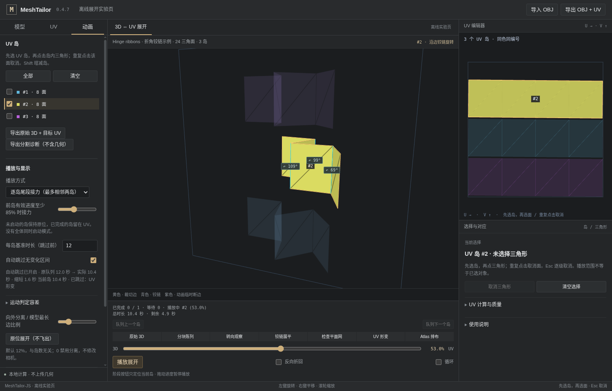

# v0.4.7 · 两级选择与建模工作台

本版基于已有 v0.4.6（ad37ab9）继续维护，修改交互与布局，没有重新初始化 Git，也没有移动旧 tag。没有更改网格分区、UV 参数化、材质布局、铰链算法或导出坐标。

## 岛与三角形分别选择

| 操作 | 结果 |
|---|---|
| 点击尚未选中的岛内任意三角形 | 只选岛，不选三角形 |
| 岛已选中，再点击其中一个三角形 | 选中该面，显示逐角对应数据 |
| 再点击同一面 | 取消选面，岛保持选中 |
| 点击同岛另一面 | 切换所选面 |
| 点击另一个尚未选中的岛 | 切换到该岛，清空旧面；不自动选中新岛的面 |
| 点击左侧岛列表或视口编号 | 只做岛选择，清空面选择 |
| Shift / Ctrl / Command 加选、减选 | 调整岛集合，不选择三角形 |
| Esc | 有面时先取消面；再次按下清空岛选择 |

“全部播放”是播放范围，不是自动获得每个岛的面检查权限。首次载入时播放队列可以包含全部岛，但显式检查选择为空。若已经通过列表选择了岛，之后第一次点击该岛三角形即可选面，第二次取消。

两侧视图使用同一个 `selection-policy.ts`。过期面编号、岛与面归属不匹配、非法索引不被接受。切换模型或获得新的 UV snapshot 后清空检查状态，不沿用旧网格的面编号。

选择或取消三角形不会重置几何进度、改变播放范围、暂停播放、移动相机或重新计算 UV。多选岛内选面不会将播放队列收缩成单岛。实际变更岛选择仍会改变检查范围并暂停；鼠标在新岛上首次点选时尽量保留该岛当前局部姿态，列表选择仍从该岛的初始姿态检查。

## 工作台布局

整体采用石墨灰背景、细分隔线、紧凑控件和单一低饱和强调色。去掉占空间的架构宣传标记，保留真正用于辨别 UV 岛、接缝和铰链的颜色。

- 左侧改为“模型 / UV / 动画”任务页。模型导入与样例、UV 求解及诊断、动画及显示参数不再混在一个长列表。
- 中央保留主要视口，播放、时间轴、阶段按钮和队列跳转靠在视口下方。
- 右侧为 UV 视图和“选择与对应”检查器。只选岛时显示岛信息和“未选择三角形”；选面后才出现顶点与 UV 对应坐标。
- 罕用参数和长说明折叠收纳，独立区域内部滚动。保留键盘焦点、空状态、任务状态、错误提示和取消入口。
- 没有改变高 DPI 画布的显示/缓冲区分离，避免旧版画布撑大问题。

共享样式位于 `apps/studio/src/workspace-theme.css` 与 `styles.css`。React Studio 和离线实验页都已修改，但二者不是同一个 UI 运行时，验证范围见下文。



截图是 v0.4.7 离线实验页真实运行画面，标题明确标记“离线展开实验页”。没有用设计稿替代运行截图，也没有将其称为完整 React Studio 实测截图。

## 运行与入口

完整 Studio：

```bash
npm install
npm run dev
```

顶部应显示 0.4.7。在“模型”页载入对象，在“UV”页生成或提取接缝，再进入“3D ↔ UV 展开动画”。点击岛后，右侧应显示“未选择三角形”。

不需要安装前端依赖的实际实验页：打开根目录 `unfold-lab.html`；浏览器限制本地文件时运行 `node scripts/serve-unfold-lab.mjs`。实验页支持 OBJ / 内置模型，FBX、GLB 导入属于完整 Studio，不在此页伪装支持。

新增回归入口：

```bash
npm run test:selection
npm run lab:build
npm run test:selection:browser
# 下面必须先成功安装真实 React/Vite 依赖；未安装时明确失败。
npm run test:selection:react
```

`test:selection:browser` 使用真实 Chromium 鼠标事件、WebGL 和生产 UV Worker。受限 Linux 无硬件 GPU 的环境可显式设置 `CHROME_SOFTWARE_WEBGL=1`；普通本机不必默认使用软件渲染。

`test:selection:react` 是 real React StrictMode + 生产 hook 的开发测试页面，不是伪 React 或模拟 hook。本轮因依赖缺失没有通过/计数；完整 Studio 测试仍是 `test:browser`。

## 本次验证及限制

20 项纯选择策略、39 项真实浏览器选择/布局/播放隔离通过；同时复跑自由相机39项、接力28项、静止跳过28项、材质分框20项、离线流程21项和布局13项，以及核心、网格、UV、铰链、方向、Git工具等回归。详见 `VALIDATION.md` 和 `../validation/v0.4.7/` 的实际报告。

本轮 npm 安装被25秒上限终止，没有得到可用依赖；独立连通性检查确认 registry.npmjs.org DNS 无法解析。实际完整构建退出127（vite: not found），全量类型检查退出2（缺少 node 类型定义），真实 React hook 测试在依赖门槛处退出1。TSX语法转译通过不等于全量类型检查。

未进行真实 Corset / FlightHelmet 模型回归，未进行 macOS / Windows / Safari 实机认证。本版不宣称修复它们的进一步分区或 UV 质量问题。

## Git 交付

v0.4.7 使用独立附注 tag；此前所有版本 tag 原样保留，并新增对原 v0.4.6 身份的校验。ZIP 包含 `.git/`，解压即可 `git log` / `git switch`；`.history/repository.bundle` 为额外恢复备份。最终 ZIP 的再次解压验证单独记录，不能由源码测试记录代替。
