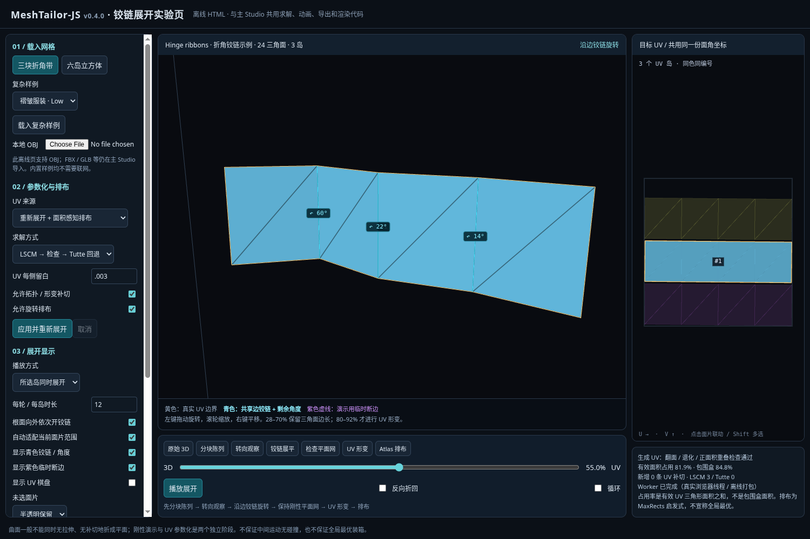

# v0.4.1（含 v0.4.0 算法说明）：铰链展开、拓扑参数化与 UV 排布

## v0.4.1 计算生命周期补充

每次 UV 计算使用独立 Worker，报告真实阶段和计数、支持取消重试，默认 120 秒预算。截止时间跨求解回退传播，主线程硬超时可以终止同步忙循环；不假装部分结果已完成。Auto 在超过 256 岛时改用 Shelf，保留统一纹素密度和留白；显式 MaxRects 最多 1,024 岛。小岛数仍按下文 MaxRects 路径。两者均非全局最优多边形装箱。

真实回归、限制和 Flight Helmet 专项运行方式见 [v0.4.1 修复说明](RELEASE-0.4.1.md)。以下 v0.4.0 截图与示例占用率保留原始版本含义，不作为新版所有输入的指标。

## 先体验新的展开方式

主 Studio 使用 `npm install`、`npm run dev`。进入“3D ↔ UV 展开动画”，选择“加载三块折角带示例”。默认目标是重新生成 UV，默认动画路径为铰链展开。先按“分块陈列”，再慢慢拖动 28–70%。点一个岛看局部，勾选多个岛或选择全部；“同时 / 逐个”与范围独立。切换到单个岛并隐藏未选岛，能看到更大的折叠细节。反向播放会沿同一路径折回。

根目录另有 **`unfold-lab.html`**，不需要 npm 运行依赖。使用支持 WebGL2 的现代浏览器打开；浏览器限制本地文件时，执行 `node scripts/serve-unfold-lab.mjs`（或 `npm run lab:serve`），访问终端显示的本地地址。此页使用主 Studio 的实际 UV 求解、动画、WebGL 绘制、2D 绘制、拾取与导出模块；离线 Worker 仅转换模块加载格式，没有另造“演示算法”。离线页支持 OBJ 和内置网格；FBX / GLB 等仍在主 Studio 导入。

离线 HTML 是有源码的生成物。改动核心后执行 `npm run lab:build` 重新生成，需要已安装或全局可用的 TypeScript。它不加载 CDN，不读取远端模型，也不上传模型。



## 为什么 v0.3.0 看起来像压扁或折叠在 UV 上

旧版本的生成目标是 `planarPackPreview`：选一个投影方向，直接舍弃一维，再把各岛塞进等大的格子。这不能代替曲面参数化。绕到背面的面片、圆筒、折皱等会在投影中重叠，某些面甚至退化成线。单纯对 source/target 顶点插值，也不会显示面片如何绕共享边打开。

v0.4.0 将两个问题分开：生成 UV 走真实拓扑 / 数值求解 / 排布流程；动画先展示刚性边铰链，再明确展示必要的非刚性 UV 形变。旧 direct / staged 动画和 `planarPackPreview` 只保留为对照或历史回归，生产 generated UV Worker 不再使用平面投影。

## 动画阶段与对应关系

以下为每个岛的局部进度；逐个模式会按所选岛数量重新映射总进度。

| 进度 | 动作 | 该阶段的几何意义 |
|---|---|---|
| 0–18% | 分块陈列 | 沿真实 UV 边界分离，移到独立的展示位置，尚未压平。 |
| 18–28% | 转向观察 | 整块刚性转动，便于看清接下来的铰链。 |
| 28–70% | 沿边打开 | 邻接三角面围绕共享边轴旋转；可由根面向外依次启动。 |
| 70–80% | 保持平面网 | 停留在刚性展开结果，便于检查边长和临时断边。 |
| 80–92% | UV 形变 | 明确从刚性平面网形变到参数化结果，不伪称无拉伸折纸。 |
| 92–100% | 放入 Atlas | 整个岛平移、统一缩放到对应 UV 槽位，不分别拉伸宽高。 |

三角面绕真实共享边旋转；变换沿面片邻接生成树传播。数学回归检查刚性阶段每个三角面的边长，以及父子共享铰链的两个端点。任意 seek 都从原始数据重算，不依赖之前播放到哪里。0% 为源网格，100% 为同一份目标 UV；右侧面板、3D 终点与 OBJ 导出没有分别生成布局。

黄色线是实际 UV 边界；青色线是当前铰链，角度标签表示剩余二面角；紫色虚线是**仅供刚性教学动画使用的临时断边**。紫色线不会改变求解目标，也不会写入 OBJ 的 UV 接缝。曲面有闭环时，刚性三角面通常不能在所有边都保持闭合的前提下全部展平，因此演示会暂时打开部分非树边；可展开的折角带不需要这些临时断边。

这不是碰撞规避或材料仿真。中间状态可能自交，刚性展开网本身也可能重叠。它不是最终 UV 合格与否的判据。最终 generated UV 独立通过数值检查；原始 UV 模式只保留输入，不自动修复。

## 新的 UV 流程

```text
原网格 + 输入接缝
  → 按面角复制 seam 两侧的自由度
  → 检查边界、Euler 数、顶点扇和方向一致性
  → 必要时显式补切成可求解区域
  → LSCM / Tutte 参数化
  → 翻面、退化、正面积重叠检查
  → 可配置的形变 / 长条 / 面数补切
  → 按 3D 表面积统一平均 texel density
  → 旋转候选 + Auto（MaxRects / Shelf）装箱 + 统一缩放搜索
  → 同一份面角 UV 用于两侧显示和导出
```

### 1. 切割拓扑，不只切 face adjacency

一条长切缝的两侧，可能仍属于同一个连通岛。不能只用 `vertex ID → UV`，否则同一源顶点的两个 UV 位置会被错误合并。`cutLocalMesh` 通过面角并查集，只跨方向相反、流形、非接缝的边连接局部顶点。纵向切开的圆筒回归验证：同一个连通曲面从双边界环带变成单边界盘，切缝两侧获得独立 UV 顶点。

非流形边、方向不一致的边以及非盘区域不会偷偷投影。允许 autoCut 时补切，新增边进入实际 3D/UV 边界、诊断和导出；关闭后无法满足要求就报错。不会静默删除源三角面或修改源坐标。零面积 3D 三角面需要先修复，当前明确拒绝。

### 2. LSCM 与稳健回退

LSCM 使用每个三角面的局部二维坐标，最小化离散 Cauchy–Riemann 残差：

`E = Σ area(t) × [(∂u/∂x − ∂v/∂y)² + (∂u/∂y + ∂v/∂x)²]`。

两个相距较远的边界顶点固定，去掉平移 / 旋转 / 尺度自由度；其余变量通过矩阵无显式组装的正规方程、对角预条件共轭梯度求解。这里确实在求 UV 变量，不是把投影换一个名称。

LSCM 不保证任意输入都无翻面或无全局重叠。默认 auto 模式检查残差、翻面、退化和三角形正面积交叠；不合格时尝试凸边界、正均匀权重的 Tutte。Tutte 的一一映射性质依赖合法盘拓扑等前提，有限精度结果仍然需要检查。该回退可能明显增加拉伸，界面会显示每个岛实际使用的方法。

`checkUVTriangles` 使用尺度归一化后的空间网格候选及三角形 SAT；共享边 / 顶点接触不算正面积重叠。不是抽样抽几张面。检测重叠数最多计到 100 即终止，因此正数是诊断上限计数，不是完整交叠总数。所有“通过”均指当前有限精度阈值内的检查，不是精确算术证明。

### 3. 形变与补切

额外分割依据面数预算、UV 长宽比、岛相对包围盒面积及局部 Jacobian 最大奇异值比。这里的 maxStretch 是各向异性指标，不是角度的度数或全局面积拉伸率。小于等于 16 面的区域不继续因形状阈值递归分裂，因此阈值是策略触发值，不是绝对上界。数值无效仍然会重试或报错，不会作为有效结果返回。

默认优先保留块的连续性，复杂闭合机械件仍可能产生很多岛；补切不是语义分割，也不保证人类服装版型。关闭 autoCut 可以严格约束输入接缝；但不合法拓扑或超过求解预算会报错。原始 UV 目标不运行这套修复。

### 4. 面积与 Atlas 利用率

先对岛使用同一个标量 `sqrt(A3D / AUV)`，让不同岛具有相同的**平均**纹素密度，再按旋转后的包围盒执行 MaxRects best-short-side-fit。尝试两个排序策略，在整个单位正方形中搜索共同的缩放因子。旋转不镜像，不独立缩放 U、V，因此不会为了塞满矩形把岛横向或纵向压扁。

UI 同时显示两种占用：

`有效 UV 占用 = 所有有效 UV 三角形面积和 / 单位 Atlas 面积`

`包围盒占用 = 所有岛包围盒面积和 / 单位 Atlas 面积`

二者不可混称。MaxRects 是矩形启发式，没有多边形凹槽嵌套，也不保证最大可达面积。保持少量连续长条、留白、降低形变、减少接缝与提高利用率常有取舍；增加切缝并不保证利用率单调提升。不能靠允许 UV 叠放或拉伸宽高来“刷满”面积指标。

实际测试中，三块折角带约 **81.9%** 有效占用；默认 Low knot 约 **29.6%**，Low garment 约 **33.8%**，Low gear 约 **54.9%**，Low assembly 约 **54.7%**。这些不是统一性能承诺。后四者的完整指标、面数、岛数、补切数量见 `docs/validation/v0.4.0/atlas.json`。没有把仍偏低的占用隐瞒成“已经最优”。

## 配置

主 Studio 的“UV 求解与排布”先编辑草稿，按“应用并重新展开”一次性生效。配置变化会取消旧 Worker；结果返回后重新开始预览。

| 字段 | 默认 | 作用 |
|---|---:|---|
| method | auto | LSCM 检查后回退 Tutte；可强制任一种方法。 |
| autoCut | true | 是否允许实际新增 UV 裁切。 |
| padding | 0.003 | 岛每侧归一化留白；两岛间至少约 2 倍该值。不是像素数。 |
| rotate | true | 搜索朝向，装箱允许 90° 旋转。 |
| rotationSteps | 12 | 一象限内候选角数；核心 API 可配置。 |
| maxChartFaces | 2048 | 单岛数值求解面数预算；不是总输入简化。 |
| maxAspect | 6 | 长条补切触发值。 |
| minFill | 0.4 | 岛相对包围盒的最低面积比触发值。 |
| maxStretch | 12 | Jacobian 奇异值比补切触发值。 |
| iterations | 2000 | 迭代预算，1–20000。 |
| tolerance | 1e-9 | 相对残差目标。 |

先保持默认观察是否需要更少接缝或更紧凑排布。提高 minFill、降低 maxAspect / maxStretch 会更容易补切；只减小 padding 只能减少空隙，不能修复折叠 / 重叠。不要把面数预算提高理解成保证求解更快。

## 开发入口与研究依据

`packages/uv/src/cut-topology.ts`、`parameterize.ts`、`uv-quality.ts`、`unwrap.ts`、`atlas-pack.ts`、`hinge.ts` 分别负责拓扑、求解、检测、调度、装箱、动画。`apps/studio/src/workers/uv.worker.ts` 统一产生不可变快照。`webgl-view.ts` 使用当前变形后的顶点进行拾取；相机按当前可见面片在相机坐标系中的范围适配，避免使用过大的包围球让面片显得很小。

以下为算法与取舍的公开一手资料。本版 TS 实现不是直接嵌入 CGAL、libigl 或作者 C++ 二进制；也未接入 xatlas / ABF++ / SLIM / ARAP 运行库。

- CGAL Surface Mesh Parameterization：盘拓扑、切割、LSCM、Tutte、映射保证的前提。https://doc.cgal.org/latest/Surface_mesh_parameterization/index.html
- libigl tutorial，Surface Parameterization / ARAP / SLIM：局部形变与参数化问题、可替代的优化路线。https://libigl.github.io/tutorial/
- RectangleBinPack 作者仓库：MaxRects 等二维矩形装箱启发式。https://github.com/juj/RectangleBinPack
- xatlas 作者仓库：chart generation 和 chart packing 的职责划分。https://github.com/jpcy/xatlas

本版研究、检查与实现之间的边界，以及浏览器运行环境的限制，见 `VALIDATION.md`。
