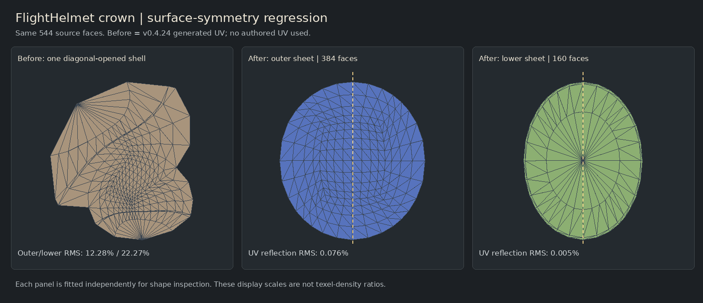

# v0.4.25 · 表面对称，而不是三角网格必须完全镜像

## 本版目标与边界

基于 v0.4.24 的真实 Git 历史继续开发。针对头盔等结构“表面接近对称，但左右顶点/三角化不同”，增加几何表面对应、完整对称层片规划、对称约束松弛与最终 UV 复验。所有生成只使用几何，原 UV 坐标、索引、切线、岛提示或恢复路径均不参与。

没有宣称任意物体已达到人工版型质量。真实头盔有 7 个识别后的对称候选未通过联合质量要求，明确保留原有效候选并报告拒绝；未识别、带复杂切口、没有可靠对应的区域仍可能不够对称或不适合手绘。没有放宽翻面/交叠检查来刷通过率。

## 1. 真实根因

用户截图的头顶盖是一个 544 面、闭合、零亏格的几何连通块。v0.4.24 将完整闭合块沿斜向路径开缝，得到一个不对称岛；仅改善最短路径转角或配对相同三角形不能解决这种结构选错的问题。

本版在该块上先识别表面对称，再比较几何主方向产生的完整层片候选，接受 384 面外层和 160 面底层。二者共享真实几何边缘，分别是完整可展的盘。全部 544 个源面恰好保留一次；不是删掉背面，也不是复制半个 UV。

## 2. 不依赖相同三角化的对应

- 按三角面面积抽样，建立三角形 BVH；镜像点匹配到另一侧的真实三角面内，保留重心坐标。
- 拓扑边界按弧长抽样。闭合薄壳没有拓扑边界时，额外检查完整的度二折边环，而不是用零散法线噪声充当轮廓。
- 几何主轴及其旋转候选提供初始平面，再以表面对应更新。排除薄平面自身的恒等反射，要求两侧实际有表面积覆盖。
- 默认匹配距离容差为部件参考直径 1.8%，表面与边界采样覆盖至少 94%，还检查误差与反射后法向。
- 原顶点近精确配对率只作诊断，不是接受门槛。实际顶盖外片约 12.9%、底片 0%，仍能建立高覆盖的表面对应。

覆盖率与误差来自有界采样，不是对连续曲面每一点的数学证明。接近对称但真实细节不同的区域不会修改三维顶点来迎合平面。

## 3. 分组、开缝、展平、后处理分别约束

闭合完整层片的识别先于对应层片的分组与开缝。每个候选要求两个部分都连通、边界简单、投影不交叠并符合相同表面对称关系；只接受完整方案，不留下“好看正面 + 未检查剩余面”。用户显式切线优先，不能因为单条切线尚未改变 Euler 值就忽略它。

一般开放且未复制切口顶点的岛也运行表面对称检测。将匹配点写成真实三角面的重心组合，在局部对称坐标系里加入 `u(a)+u(b)=0`、`v(a)-v(b)=0` 的软约束，同时优化内在 ARAP 度量。没有从源 UV 取初值，没有把半片 UV 复制过去。

已可靠开口的环带等继续沿用原结构方案。已经复制了切口顶点的区域不直接施加可能粘回切口的镜像约束；本版未解决任意复杂切口的全局匹配问题。

候选需通过三角形有效性、边界简单性、局部形变与反射误差检查。成功区域保存几何派生的表面对应契约，保护其边界；初始缝合、独立缝合、重排、自动或独立填空之后对实际输出再验一次，不能靠后处理无声破坏对称。失败保留上一份完整输出，不发布部分结果。

## 4. 同一批真实面的前后对照

下面的旧结果是 **v0.4.24 纯几何生成结果**，不是原模型作者 UV。对相同源三角面、相同几何对应评价各自 UV 的最佳刚性反射；误差除以该片当前 UV 的参考直径。只去掉整体位置/旋转/尺度，不用任意剪切拟合。

| 同一源区域 | v0.4.24 生成 UV 反射 RMS | 本版生成 UV 反射 RMS | 本版最大误差 |
|---|---:|---:|---:|
| 外层 384 面 | 12.283% | 0.076% | 0.370% |
| 底层 160 面 | 22.274% | 0.005% | 0.042% |



各小图独立适配尺寸，仅比较形状，不能用图上面积比较纹素密度。它不是手绘语义评分，圆形/椭圆形本身也不是错误；本部件几何有这样的外边缘，不是 Tutte 强制圆周回退。

## 5. 整模、拒绝与后处理

工厂默认纯几何生成，无额外后缝合或填空：

| 模型 | 源面，全部保留 | 最终岛 | 有效面积 | 已验证对称契约 | 未通过候选 |
|---|---:|---:|---:|---:|---:|
| 正确 Corset | 18,324 | 84 | 59.903% | 29 | 0 |
| 正确 FlightHelmet | 94,722 | 189 | 57.298% | 25 | 7 |

人台 27 个候选经过约束松弛、2 个已有足够对称的有效形状；头盔 16 个经过约束松弛、9 个已有足够对称形状。未通过的7片在逐岛诊断中明确显示，不把“几何有效”当作“对称已解决”。其余未识别的岛也不代表已经验证为不对称。

从这些生成快照继续执行实际 Worker 的邻边缝合（64次候选预算）、重排、3秒/2轮填空，分别为人台79岛、头盔164岛。所有29/25个契约均保留并再次通过，全部面保留。这不是用户截图148岛那一套参数的逐项复现，也不是最佳填充率测试。

生成输入分别携带原 UV、无 UV、随机 UV，两个模型的六条路径切线/面角 UV/OBJ逐字节一致。独立 GEOS/Shapely 检查实际导出 OBJ，正面积重叠0，检查阈值1e-14 UV²，三维位置和面顺序不变。Python仅用于额外QA，不是运行依赖。

## 6. 操作

`UV → 通用分组剥展 → 按表面识别并约束对称` 默认开启；保持“手绘轮廓优先 + 自动”，重新载入或 Generate baseline 即生效。不使用当前相机猜对称轴，不重置自由相机。

高级设置可调几何匹配容差、约束强度和迭代预算。更改设置不会立刻覆盖当前结果，必须重新生成；增大容差可能误识别，不是保证越大越好。

选岛检查器显示表面采样覆盖、采样顶点近精确配对和当前 UV 反射误差；填空或重排后按当前坐标复算，不沿用旧成功标签。常规 UI 与离线工作台使用同一说明模块。

旧的逐岛面积排序、倍速、停顿跳过、落位保持/渐隐的动画时钟、自由相机和先岛后面选择规则未替换。本次也未修改轮廓填空算法和密度政策。

## 7. 复现

```bash
npm run test:surface-reflection
npm run test:symmetry-metric
npm run test:symmetric-sheets
npm run test:geometry:real -- --snapshot --out validation/local-real
npm run lab:build
npm run test:surface-symmetry:browser
npm run results:restore
```

全部运行算法是 JS/TS。完整 Studio 使用 `npm install`、`npm run dev`；离线入口为 `unfold-lab.html`，必要时 `node scripts/serve-unfold-lab.mjs`。

## 验证限制

本轮完整 React/Vite 构建未通过：安装尝试25秒超时，build退出127缺Vite，typecheck退出2缺Node类型。离线DOM/生产Worker/WebGL通过不替代通用Three.GLTFLoader、FBX入口或完整React认证。真实浏览器运行在Chromium软件WebGL，不保证大型模型开启全部线框/叠层时的帧率；生成算法也未在macOS/Windows/Safari实机认证。

表面对应与约束能消除一类三角化依赖，但不是通用语义理解器；并非所有片都被识别、所有细节都能强制对称。背景：Geometry Central 的 SurfacePoint/重心表示，libigl 的局部-全局 ARAP 及线性约束；本代码是独立实现，不依赖这些库，也不宣称它们解决人工版型识别。

参考：
- https://geometry-central.net/surface/utilities/surface_point/
- https://libigl.github.io/tutorial/
