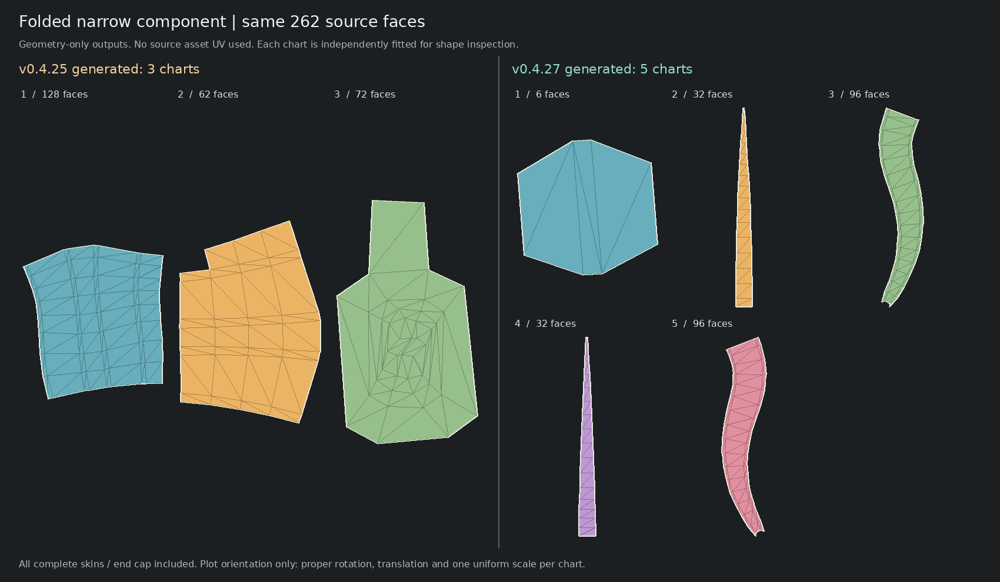
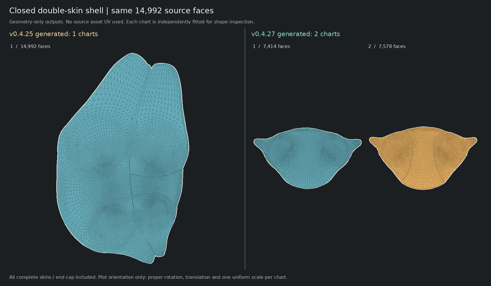

# v0.4.27 · 完整双层壳、纵向条片与对称识别的续修

## 使用

打开根目录 `unfold-lab.html`，或执行 `node scripts/serve-unfold-lab.mjs`。顶部为 **0.4.27**。重新载入内置“飞行头盔 · 纯几何”，使用默认 **手绘轮廓优先 / 自动 / 按表面识别并约束对称**；Generate baseline 和自动载入走相同路径。

这不是只修改编号 #120 或 #20。生产规则不含资产名称、截图岛号、测试部件面数或原 UV；测试中的固定面数仅定位同一份 QA 部件。文件输入、空间分组、切缝、初始化、求解失败恢复均不允许读取模型原 UV。

## 1. 本轮确认的原因

**长条结构：**旧表面对称搜索为了排除薄片的“恒等反射”，要求镜像法线方向的宽度超过整块直径的12%。长而窄的结构恰好会被这条规则排除；不是它真的没有左右对应。如今改为数值宽度保护，并相对横向宽度检查两侧支持，仍要求表面距离、边界、法线的一致性，未降低默认几何覆盖率门槛。

该262面部件是带端面的弯曲多棱挤出体，不是一张平面纸。旧流程把端面、前后面和侧面交给同一初始切图，求解失败后横向二分，形成右上/左下片。新流程先找贯穿全长的实际折边与侧面，再展开这些完整面板；细倒角并入相邻宽侧面，不默认留下八条独立细条。

**大壳面：**该14,992面连通块是闭合的双层曲壳。旧流程将内外层作为一张表面开斜缝，又因为已存在重合切口而跳过不具分支识别能力的对称约束。新规则先识别整个壳的反射，再按几何径向朝向寻找内外两层，沿真实共有边缘分开，两层各自检查完整盘状拓扑和表面对称后求解。

此外发现一条约束遗漏：分组阶段识别成功，求解阶段换了面遍历顺序重新采样，却可能在覆盖阈值附近返回“未识别”，旧代码没有拒绝这个空结果。现在将已经验证的几何重心对应按源面编号传到求解器；已声明对称的完整层片必须返回实际约束与检查结果，不能静默丢失。

## 2. 实际展开结果与取舍

| 同一完整部件 | v0.4.25纯几何生成 | 本版 |
|---|---|---|
| 弯曲长条，262面 | 128 / 62 / 72 面的3个片，存在横向错开 | **32 / 32 面的两张贯穿主面，96 / 96 面的两张回折侧面，6面的端盖；共5片** |
| 双层大壳，14,992面 | 一张斜向开缝的整体片 | **7,414 / 7,578 面的两张完整层片** |

这是保留合理结构而增加少量必要切缝，不以“岛数更少”作为唯一目标。全部源三角面恰好出现一次，未删除背面或小端盖，未移动原3D顶点。

长条的主要面使用内在三角形边长依次展开，不做强制矩形投影。只有边界占比高、边长一致性通过的可展条片才接受该初值；有环路冲突或非可展形变时不把它当成通用正确答案。回折侧面仍需受验证的自由边界展开，允许真实弯曲轮廓，不能将所有侧面硬拉直。

独立局部对照中，两张32面主片的归一化镜像RMS均小于3e-9；两张96面侧片之间用103个几何表面对应点审计，去除排布的旋转、平移、公共尺度并反射后，RMS约 **0.00333%**，最大偏差约 **0.01616%**。这不是复制一侧UV或模型作者UV。

两张大壳的归一化表面镜像RMS分别约 **0.1109% / 0.1000%**，边界RMS约0.1209% / 0.1240%。保留独立源面集合与布局空间，不把两层纹理叠放。

对照图是完整部件的旧**生成结果**与新结果，不是原UV。每片独立适配显示比例，并作显示用正规旋转，不能根据图里的面积比较纹素密度：





## 3. 后处理不能破坏已验证的结构

完整纵向面组和完整壳面组的边界进入保护集合。默认生成、缝合、重排、填空后的实际UV都重新验证面归属及表面反射关系。改变位置、旋转和等比例缩放可以；把一组又混入另一组，或把约束过的形状拉歪，不可作为成功结果提交。

这不是全模型对称/语义识别已经完成。默认整模中人台29个岛通过表面对称约束，头盔30个通过，头盔另5个识别候选未满足联合质量条件，保留有效的非强制结果并报告拒绝。未匹配或真实不对称的区域不被自动复制/镜像成对称。

## 4. 纠正上一阶段对自动填空的误改

上一阶段认为 `resolveLoadPipeline()` 中 `fillMode:'off'` 表示没有执行填空，这个判断不准确：Worker 原本就会在初始排布后按 `pipeline.fill` 调用一次独立精排。把前者同时改成 area-priority 会导致重复计算，并覆盖用户设置的共同增益、试装等参数。

本版改为明确单一入口：

```
纯几何生成 → 初排（内部不精排）→ Worker按配置精排一次 → 全量检查 → 3D/UV对应
```

实际Worker测试比较“未填空的初排面积”和“开启填空报告的before面积”，两者相等，并检查只有一个填空阶段；显式设置1.6密度上限、2倍共同增益、关闭空位适配等均保留。不是关闭用户的填空操作。**本版没有新增更激进的装箱算法或宣称已经消除全部空白。**

## 5. 正确真实模型回归

本版默认非后缝合、非额外精排结果：

| 模型 | 全部源面 | 岛数 | 实际UV面积占用 | 翻面/退化/正面积交叠 |
|---|---:|---:|---:|---|
| Corset | 18,324 | **84** | **59.9030%** | 0 / 0 / 0 |
| FlightHelmet | 94,722 | **191** | **53.1433%** | 0 / 0 / 0 |

两模型均执行 original / absent / random UV 三变体，所有真实切线、逐角UV与OBJ逐字节一致。独立GEOS/Shapely对最后OBJ复核，阈值1e-14 UV²，交叠数0；Python仅用于QA，不是应用依赖。

开启共享边后缝合是另一套配置，岛数会不同；不把该配置与上表混用。四模型的“自动生成+后缝合+填空”另实际测试，搜索3秒/2轮仅用于步骤和质量回归，不是最高填充率测量。

## 6. 运行、测试与参考结果

```
npm run test:continuous-structure:unit
npm run test:continuous-structure
npm run test:fill-once
node --expose-gc --max-old-space-size=1280 scripts/geometry-real-smoke.mjs --assets Corset,FlightHelmet --snapshot --out validation/local-geometry
npm run lab:build
npm run test:continuous-structure:browser
npm run results:restore
```

本机需要Node22.16+、TypeScript；重新构建前端的完整依赖仍使用npm install。离线页已构建好，不需要npm或联网下载模型。恢复出的四份OBJ是本次生成结果，生成器不会拿它们作源UV恢复；本工具重导入时仍忽略其中的UV。查看精确导出请使用外部查看器。

## 7. 限制和可追溯记录

规则受几何可展性、边界质量、采样分辨率与预算限制，不保证任意模型的每一岛均可人工直观识别。弱/不可靠反射不强制施加；纵向条片识别也不是任意曲面都应被拆成长条。

完整React/Vite主入口在本环境仍未完成构建：实际build缺Vite，完整typecheck缺Node类型。核心严格TS、真实Worker、离线工作台分别记录，不能互相替代。大型模型软件WebGL的交互/截图可能很慢，没有硬件帧率承诺。

本轮可恢复基线为v0.4.25。v0.4.26文件引用没有可下载字节，已按上轮可见差异建立明确恢复提交，再逐项校正；没有伪造缺失的.26 Git对象或tag。已有v0.4.25及以前标签不变，新发布独立v0.4.27。详见 `docs/repack/RECOVERY-0.4.26.md`。
